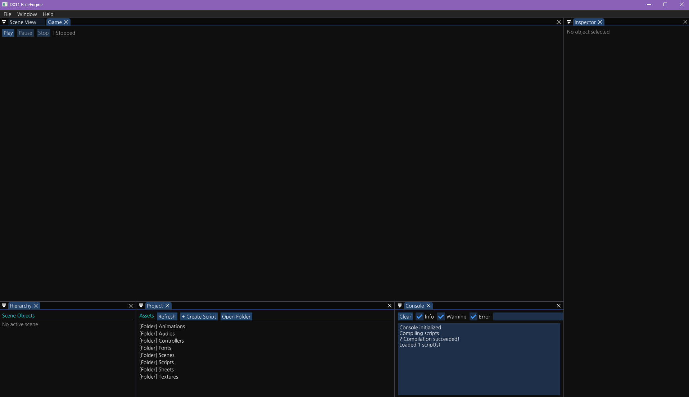
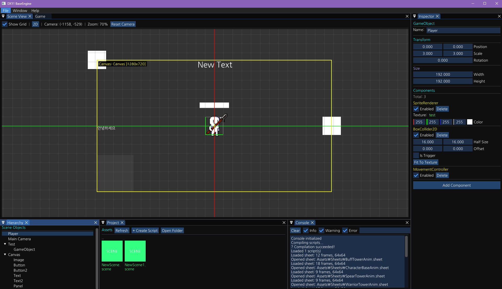
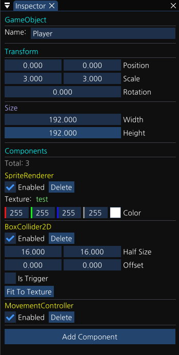
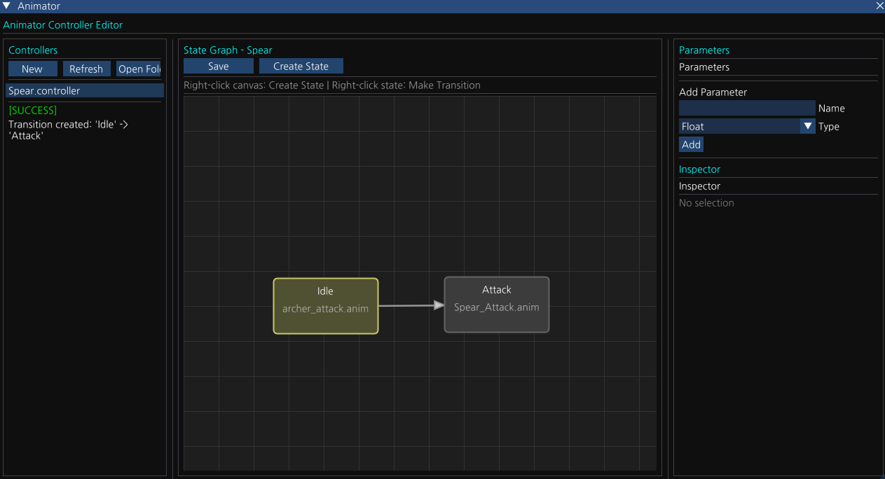
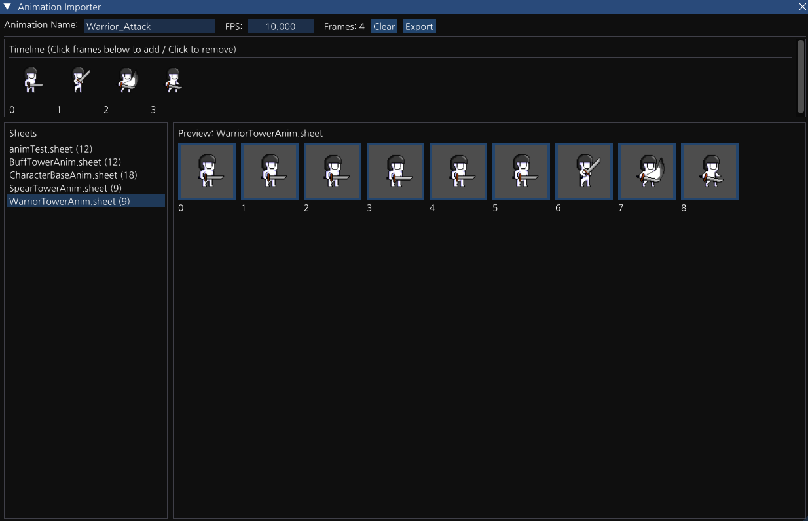
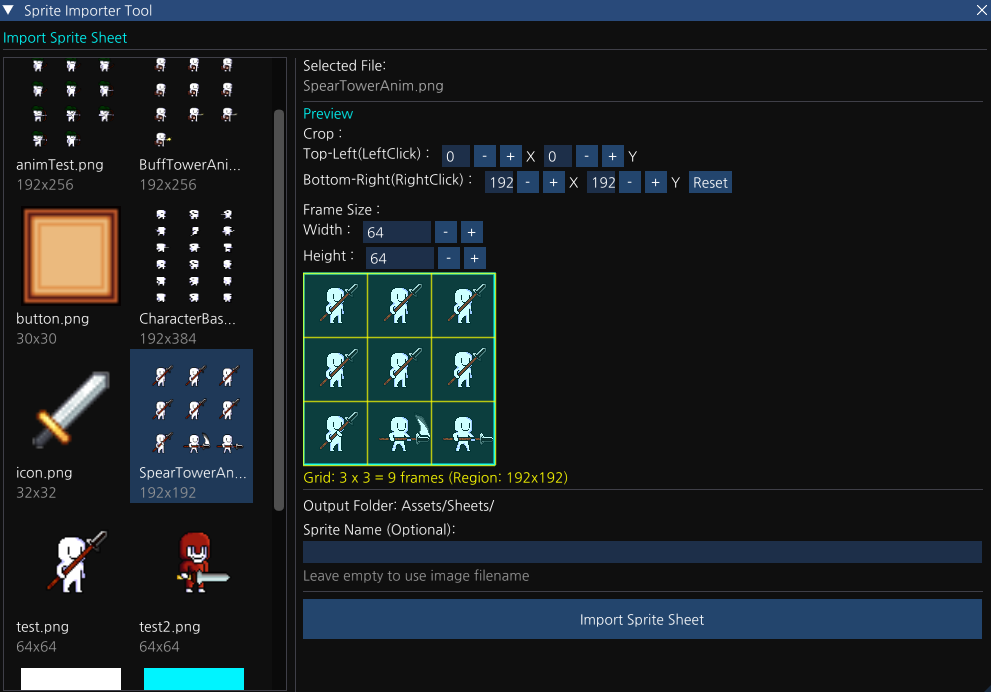
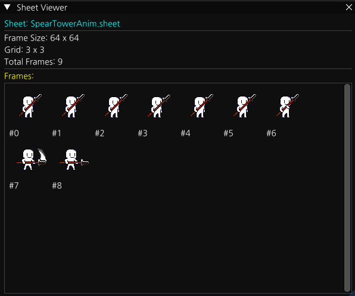

<div align="center">

# BaseEngine

**DirectX 11 기반의 C++ 2D 게임 엔진**

C++17과 DirectX 11을 사용하여 제작된 2D 게임 엔진입니다.  
물리 시뮬레이션, 애니메이션 상태 머신, 씬 직렬화, 런타임 스크립팅, ImGui 기반 에디터까지  
게임 개발에 필요한 핵심 기능들을 직접 구현하였습니다.

[](https://opensource.org/licenses/MIT)


</div>

---

## 목차

- [주요 기능](#주요-기능)
- [에디터 미리보기](#에디터-미리보기)
- [프로젝트 구조](#프로젝트-구조)
- [사용된 라이브러리](#사용된-라이브러리)
- [개발 방식](#개발-방식)

---

## 주요 기능

### Core System

- **GameObject / Component 아키텍처** — 템플릿 기반 유연한 컴포넌트 시스템
- **Scene Management** — 다중 씬 전환 및 씬 레지스트리 관리
- **Hierarchy** — 부모-자식 관계 기반 오브젝트 계층 구조
- **LifeCycle** — `Awake` → `OnEnable` → `FixedUpdate` → `Update` → `LateUpdate` → `Render` → `OnDestroy`

### Physics System

- **Rigidbody2D** — 2D 물리 시뮬레이션 (중력, 속도, 힘 적용)
- **Collider Components** — `BoxCollider2D`, `CircleCollider` 지원
- **CCD (Continuous Collision Detection)** — 고속 이동 물체의 충돌 누락 방지
- **Quadtree** — 공간 분할 기반 충돌 감지 최적화
- **Collision / Trigger Events** — 충돌 및 트리거 콜백 지원

### Graphics System

- **SpriteRenderer** — 2D 스프라이트 렌더링 (회전, 스케일, 색상 지원)
- **Camera2D** — 2D 카메라 시스템 (이동, 줌 지원)
- **RenderTexture** — 오프스크린 렌더링 (에디터 GameView 등에 활용)
- **GridRenderer** — 에디터용 격자 렌더링
- **ShaderManager** — HLSL 셰이더 컴파일 및 관리
- **DebugRenderer** — 디버그용 기즈모 렌더링 (콜라이더 시각화 등)

### Animation System

Unity AnimatorController와 유사한 **State Machine 기반 애니메이션 시스템**입니다.

- **AnimationState** — 단일 애니메이션 상태 (AnimationClip과 연결)
- **AnimationStateMachine** — 상태 전환 로직 관리
- **AnimationTransition** — 파라미터 조건 기반 상태 전환
- **AnimatorController** — 런타임 상태 머신 제어기
- **AnimatorParameter** — `Bool` / `Int` / `Float` / `Trigger` 파라미터 지원

### UI System

- **Canvas** — UI Root Container
- **RectTransform** — 앵커 기반 UI 레이아웃 (9가지 앵커 프리셋 지원)
- **UIBase** — 공통 UI 컴포넌트 베이스 클래스
- **Image** — UI 이미지 컴포넌트
- **Panel** — UI 패널 컴포넌트
- **Button** — 클릭 / 호버 이벤트 지원
- **Text** — 비트맵 폰트 렌더링 (`.spritefont` 포맷 사용)
- **Slider** — 슬라이더 컴포넌트
- **ScrollView** — 스크롤 뷰 컴포넌트

<details>
<summary><b>SpriteFont 변환 명령어 예시</b> (클릭하여 펼치기)</summary>

```powershell
# Tool/MakeSpriteFont.exe 사용 (Windows에 설치된 패밀리 폰트만 변환 가능)
.\MakeSpriteFont "NanumGothic" NanumGothic.spritefont `
  /FontSize:32 /FontStyle:Regular /FastPack `
  /CharacterRegion:0x20-0x7E `
  /CharacterRegion:0xAC00-0xD7A3 `
  /DefaultCharacter:0x003F
```

</details>

### Audio System

- **AudioManager** — XAudio2 기반 오디오 관리 싱글톤
- **AudioClip** — WAV / MP3 파일 로드 및 관리
- **AudioSource** — 재생, 일시정지, 정지, 볼륨 / 피치 제어, 루프 재생

### Resource System

- **Resources** — 자동 에셋 캐싱 및 경로 기반 로드
- **Texture** — PNG, JPG 등 이미지 로드
- **SpriteSheet** — 스프라이트 시트 (`.sheet` 포맷) 지원
- **AnimationClip** — 애니메이션 클립 에셋
- **Font** — TTF/OTF 기반 비트맵 폰트 에셋
- **Prefab** — 프리팹 에셋 지원
- **SceneData** — JSON 기반 씬 에셋

### Input System

- 키보드 및 마우스 입력 처리
- `GetKey`, `GetKeyDown`, `GetKeyUp` 방식의 실시간 입력 상태 감지

### Serialization System

- **SceneSerializer** — `nlohmann/json` 기반 씬 전체 직렬화 / 역직렬화
- 에디터에서 저장한 씬을 JSON 파일로 저장하고, 런타임에 불러오기 가능

### Scripting System

엔진 재빌드 없이 게임 로직을 외부 C++ 스크립트로 분리하여 컴파일·로드하는 시스템입니다.

- **ScriptCompiler** — C++ 스크립트를 MSBuild를 통해 런타임 컴파일
- **ScriptLoader** — 컴파일된 DLL을 동적으로 로드
- **ScriptProjectGenerator** — 스크립트용 `.vcxproj` 파일 자동 생성
- **MSBuildLocator / PathResolver** — 빌드 환경 자동 탐색 유틸리티

### Editor Tool (ImGui 기반 통합 에디터)

> **[AI 활용 개발]** 에디터 Tool 시스템의 ImGui 기반 UI 구현은 AI의 도움을 받아 설계 및 개발되었습니다.

Unity Editor와 유사한 **멀티 윈도우 ImGui 에디터**를 내장하고 있습니다.

| 윈도우 | 설명 |
|---|---|
| `EditorManager` | 전체 에디터 윈도우 생명주기 관리 |
| `HierarchyWindow` | 씬 계층 구조 표시 및 오브젝트 편집 |
| `InspectorWindow` | 선택된 오브젝트의 컴포넌트 속성 편집 |
| `SceneViewWindow` | 에디터 카메라 기반 씬 뷰 |
| `GameViewWindow` | 플레이 모드 게임 뷰 (RenderTexture 기반) |
| `ProjectWindow` | 에셋 파일 브라우저 |
| `AnimatorWindow` | 애니메이션 상태 머신 편집기 |
| `AnimationImporterWindow` | 애니메이션 데이터 임포터 |
| `SpriteImporterWindow` | 스프라이트 시트 임포터 (`.sheet` 파일 생성) |
| `SheetViewerWindow` | `.sheet` 파일 미리보기 |
| `ConsoleWindow` | 런타임 로그 콘솔 |

---

## 에디터 미리보기

**에디터 초기 화면**

<div align="center">
  
</div>

**씬 편집 화면**

<div align="center">
  
</div>

**인스펙터**

<div align="center">
  
</div>

**툴 윈도우**

<div align="center">
  
  
</div>

<div align="center">
  
  
</div>

---

## 프로젝트 구조

```
BaseEngine/
├── Inc/                        # 외부 라이브러리 헤더
│   ├── ImGui/                 # ImGui UI 라이브러리
│   ├── nlohmann/              # JSON 직렬화 라이브러리
│   ├── DirectXTex.h           # DirectX 텍스처 유틸리티
│   ├── Audio.h                # DirectXTK Audio (XAudio2)
│   └── ...
├── lib/                        # 외부 라이브러리 .lib 파일
│   ├── DirectXTK.lib
│   └── DirectXTex.lib
├── Engine/                     # 엔진 코어
│   ├── Core/                  # GameObject, Component, Scene, Transform, Timer
│   ├── Graphics/              # SpriteRenderer, Camera2D, RenderTexture, ShaderManager
│   ├── Physics/               # Rigidbody2D, Collider, PhysicsSystem, Quadtree
│   ├── UI/                    # Canvas, UIBase, Button, Image, Panel, Text, Slider
│   ├── Audio/                 # AudioManager, AudioClip, AudioSource
│   ├── Input/                 # 입력 처리
│   ├── Animation/             # AnimatorController, StateMachine, Transition, Parameter
│   ├── Resource/              # Resources, Texture, SpriteSheet, Font, Prefab, SceneData
│   ├── Scripting/             # ScriptCompiler, ScriptLoader, ScriptProjectGenerator
│   └── Serialization/         # SceneSerializer (JSON 기반 씬 저장/불러오기)
├── Game/                       # 게임 프로젝트
│   ├── Assets/                # 게임 에셋 (텍스처, 오디오, 폰트 등)
│   ├── Scenes/                # 게임 씬
│   ├── Scripts/               # 커스텀 컴포넌트
│   ├── Shaders/               # HLSL 셰이더
│   └── main.cpp
├── Tool/                       # ImGui 기반 에디터 (AI 협업 개발)
│   ├── EditorManager          # 에디터 진입점 및 윈도우 관리
│   ├── HierarchyWindow        # 씬 계층 구조 편집기
│   ├── InspectorWindow        # 컴포넌트 속성 인스펙터
│   ├── SceneViewWindow        # 에디터 씬 뷰
│   ├── GameViewWindow         # 게임 플레이 뷰
│   ├── ProjectWindow          # 에셋 파일 브라우저
│   ├── AnimatorWindow         # 애니메이션 상태 머신 편집기
│   ├── AnimationImporter      # 애니메이션 임포터
│   ├── SpriteImporter         # 스프라이트 시트 임포터
│   ├── SheetViewerWindow      # .sheet 파일 뷰어
│   ├── ConsoleWindow          # 런타임 콘솔
│   └── MakeSpriteFont.exe     # 비트맵 폰트 변환 도구
├── Images/                     # README 스크린샷
└── Docs/                       # 내부 설계 문서
    ├── RenderingPipeline.md
    ├── PhysicsSystem.md
    ├── CCD_and_SpatialPartitioning.md
    ├── UI_System_Guide.md
    └── DevelopmentRoadmap.md
```

---

## 사용된 라이브러리

| 라이브러리 | 용도 |
|---|---|
| [DirectX Tool Kit](https://github.com/microsoft/DirectXTK) | SpriteBatch, SpriteFont, SimpleMath 등 DirectX 유틸리티 |
| [DirectXTex](https://github.com/microsoft/DirectXTex) | 텍스처 로딩 및 처리 |
| [XAudio2](https://docs.microsoft.com/en-us/windows/win32/xaudio2/xaudio2-introduction) | 오디오 처리 (Windows SDK 내장) |
| [ImGui](https://github.com/ocornut/imgui) | 에디터 GUI 라이브러리 |
| [nlohmann/json](https://github.com/nlohmann/json) | JSON 기반 씬 직렬화 |

---

## 개발 방식

엔진 코어(`Engine/`)는 DirectX 11과 DirectXTK를 기반으로 직접 설계하였습니다.  
에디터 시스템(`Tool/`)의 **ImGui 기반 멀티 윈도우 UI** 구현은 AI의 도움을 받아 설계 및 개발되었습니다.

---

<div align="center">

**BaseEngine** — 2D 게임 엔진 직접 구현 프로젝트

</div>
